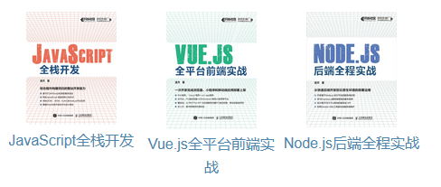

# 个人简历

姓名：凌杰，网名：owlman，性别：钢铁直男，中国浙江杭州人氏。本因幼时身患残疾，丧失行动自由和生活自理能力，无缘离家接受高等教育，后来幸运获得浙江大学特许，于 2002 年入其远程教育学院（现为浙江大学继续教育学院）学习计算机科学专业，并以该学院“荣誉学员”的身份于 2006 年完成本科学业。目前为独立软件开发者、计算机专业领域的写作者兼翻译，业余时常参与软件开源、以及国内外各种技术社区的线上活动，曾在 2003 至 2012 年间活跃于上海交通大学饮水思源 BBS 的电脑技术技术区，并担任过该区区长与 C 板板主。

## 曾获荣誉

- 2012 年获得浙江大学远程教育学院首届十大远程骄子；
- 2013 年获得人民邮电出版社信息技术分社“译笔生辉”奖；
- 2016 年获得人民邮电出版社信息技术分社年度最佳译者；
- 2020 年获得全国现代远程教育试点 20 周年优秀学生奖；
- 2021 年获得人民邮电出版社异步社区“年度影响力作者”奖；

## 常用工具

- **标记语言**：HTML、CSS、Markdown、LaTeX；
- **编程语言**：JavaScript、Python、Shell、C、Rust；
- **操作系统**：Windows、Ubuntu、HarmonyOs、macOS；
- **写作工具**：VS Code、Obsidian、flomo卡片笔记本；
- **开发工具**：Git、NeoVim、IntelliJ IDEA、Visual Studio；
- **社交工具**：知乎、豆瓣、微信、Twitter、Facebook；

## 开源项目

| 项目名  | 内容简介              |
| ------- | ----------------- |
| [《计算机研究笔记》](https://github.com/owlman/study_note) | 这是一个持续更新的，我个人在研究计算机科学过程中所积累的笔记库（和代码）。 |
| [《个人业余知识库》](https://github.com/owlman/Knowledge_base) | 这是一个持续更新的，基于 Obsidian 笔记系统建立的的个人业余知识库，其中包含了本人在计算机专业之外所分享的读书感悟、知识整理与观点分析。 |
| [《Markdown 写作指南》](https://github.com/owlman/markdown_guide) | 与人民邮电出版社合作的电子书籍，是一本简单介绍如何使用 Markdown 进行论文级别写作的小书。|
| [《网络生活》](https://github.com/owlman/onlinelife) | 这是一本自传性质的，探讨互联网时代生活方式的小书，目前仍在断断续续的创作中。 |

## 原创作品

| 书名  | 内容简介              |
| ----- | ----------------- |
| [《JavaScript 全栈开发》](https://book.douban.com/subject/35493728/) | 2021 年 6 月由人民邮电出版社出版，这是一本 JavaScript 入门指南。它回答了如何单独使用 JavaScript 这门编程语言解决 Web 应用程序前后端开发过程中涉及的所有技术栈问题，帮助 Web 开发者减少其需要使用的编程语言种类。 |
| [《Vue.js 全平台前端实战》](https://book.douban.com/subject/35886403/) | 2022 年 5 月由人民邮电出版社出版，本书是《JavaScript 全栈开发》在前端开发方面的续作，它将以 Vue.js 框架及其在移动端的扩展框架 uni-app 为中心来探讨如何开发面向同一 Web 服务的不同形式的前端。 |
| [《Node.js 后端全程实战》](https://book.douban.com/subject/36374893/) | 2023 年 4 月由人民邮电出版社出版，本书是《JavaScript 全栈开发》在后端开发方面的续作，它将以基于 Node.js 运行平台的 Express.js 框架为工具为读者介绍开发并维护一个服务端应用所涉及的全部技术栈。 |

## 翻译作品

| 书名  | 内容简介              |
| ------- | ----------------- |
| [《测试驱动的 JavaScript 开发》](https://book.douban.com/subject/10483528/) | 2011 年 9 月由机械工业出版社出版，致力于介绍测试驱动型的编程方式。|
| [《Visual C++ 并行编程实战》](https://book.douban.com/subject/11580452/) | 2012 年 8 月由机械工业出版社出版，致力于介绍基于 Visual C++ 平台的并行编程库。       |
| [《JavaScript 面向对象编程指南》（第 1 版）](https://book.douban.com/subject/21372235/) | 2013 年 3 月由人民邮电出版社出版，这是一本关于 JavaScript 的编程教材。       |
| [《HTML5 和 CSS3 快速参考》](https://book.douban.com/subject/25730129/) | 2013 年 9 月由人民邮电出版社出版，这是一本面向 HTML5 和 CSS3 的速查手册。      |
| [《元素模式》](https://book.douban.com/subject/25908396/) | 2014 年 7 月由电子工业出版社出版，这是一本获得 Jolt 大奖的，关于设计模式理论的专着。 |
| [《JavaScript 面向对象编程指南》（第 2 版）](https://book.douban.com/subject/26302623/) | 2014 年 12 月由人民邮电出版社，对该书第一版的重新修订。            |
| [《Python 算法教程》](https://book.douban.com/subject/26699412/) | 2016 年 1 月由人民邮电出版社出版，是一本关于算法设计的教材。      |
| [《Git 学习指南》](https://book.douban.com/subject/26967729/) | 2016 年 12 月由人民邮电出版社出版，致力于介绍一种分布式版本控制系统。      |
| [《NLTK 基础教程》](https://book.douban.com/subject/27057666/) | 2017 年 6 月由人民邮电出版社出版，这本书主要介绍如何通过 NLTK 等一系列 Python 库来实现与自然语言处理相关的机器学习应用。|
| [《C++ 程序设计》（第 3 版）](https://book.douban.com/subject/34711734/) | 2019 年 8 月由人民邮电出版社出版，这本书是针对计算机科学专业领域的 C++ 编程课程而编写的一本教科书，适合没有编程经验的学生，以及有其他语言编程经验的学习者。 |
